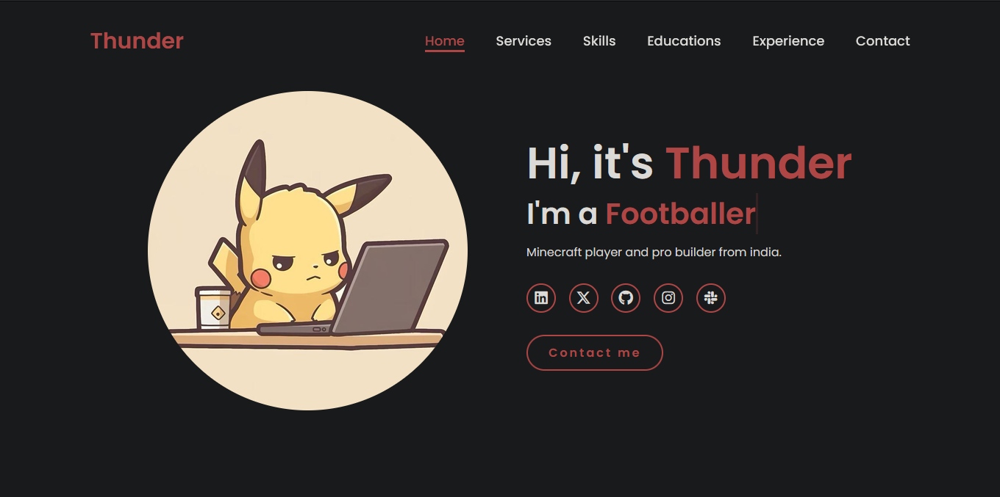

# Thunder Portfolio

This is my personal portfolio website where I put everything I'm working on smtn like projects, games, random experiments, and a few hidden easter eggs. I built it to learn web development.

## Screenshot



## About this web

About page
Projects page
Experience page
Extras page
Custom animations and interactions
Pages with with hidden stuff (type secret for surprise)

## Tech Stack

HTML
CSS
JavaScript
Git & GitHub
Vercel

## Learning

This project taught me a lot about websites. I learned how to structure a multi-page website, improve CSS, make the site responsive for phones, use JavaScript for animations and interactions.

## Goals

My goal is to improve my web dev as I learn more. Im using it as a place to experiment with new ideas and as a portfolio for future Hack Club and programming projects.

## Resource

    YouTube
    MDN Web Docs
    HTML, CSS, and JS

## Contributing

To run this project locally, first clone the repo!

```
git clone https://github.com/tanmay-19-cris/personal-website.git
```

Change the directory to project folder and Run a simple HTML live server.. like VSCODE'S LIVE SERVER :D

## AI Usage

    I messed up css like... navbar was overlapping on my intro animation. And ik that AI hours has more than 30% but i didn't use AI more than 30%. I didn't know that copy pasting and AI code stuff exists and i used AI for just TEST of MInigames page and i deleted that code too. Still my project got rejected in beest and treasure hunt, I told  reviewer the real reason. I saw AI hours chart in my brother's laptop and then i realise that AI chart thing. My brother is a reviewer and he knows i didn't use AI. He's slack is @chish.
